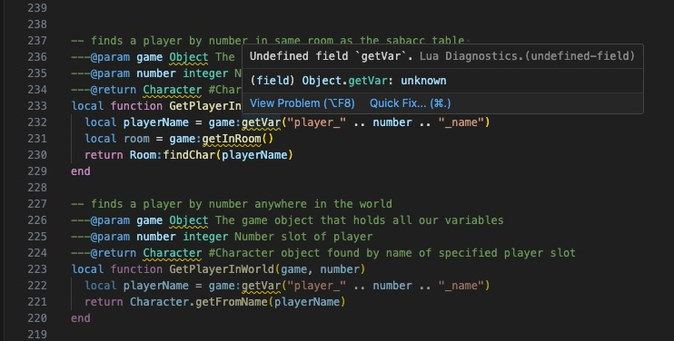

# LotJLuaAPI-Scraper
Scrapes the LotJ Lua API to create Lua function definitions for your Lua scripting environment

---
### Brief
Download the pre-built library of LotJ Lua API definitions *[here](https://github.com/Johnson336/LotJLuaAPI-Scraper/tree/main/LotJLuaAPI)*, or download the JavaScript web scraper program and follow the directions below to scrape the LotJ Lua API website to generate your own copy of definition files.

### Summary
This is a JavaScript web scraper utilizing NodeJS libraries Cheerio, Axios, and FS to generate
Lua function definitions and format them into a valid file structure for use in creating a LotJ Lua 
scripting environment in your VScode, Neovim, or other modern coding program. These definitions will provide autocompletion while 
showing full function descriptions, usage examples, function parameters, and function return values.

### __Before__
LotJ Lua API functions and data types are unrecognized.


### __After__
LotJ Lua API-specific functions and data types are recognized based on the data scraped from the public LotJ Lua API website, providing autocompletion of function descriptions, Usage examples, accurate function parameter prototypes and return values.


---
### Usage
Install latest NodeJS following instructions *[here](https://nodejs.org/en/learn/getting-started/how-to-install-nodejs)*

Clone repo onto your machine:<br>
`git clone https://github.com/johnson336/lotjluaapi-scraper.git`

## ** NOTE: This step can be skipped if you wish to use the pre-scraped API included in this project. Simply use the LotJLuaAPI folder as-is without running the scraper. **
`node index.js`<br>
Run the JavaScript web scraper and you should see output similar to this
```
Node.js v21.3.0
% node index.js
writing header to file 'Area.lua'
writing header to file 'Charproto.lua'
writing header to file 'Character.lua'
writing header to file 'Clan.lua'
writing header to file 'LOTJ.lua'
writing header to file 'Exit.lua'
writing header to file 'Furniture.lua'
writing header to file 'Objproto.lua'
writing header to file 'Object.lua'
writing header to file 'Planet.lua'
writing header to file 'Room.lua'
writing header to file 'Ship.lua'
writing header to file 'Shiptemplate.lua'
writing header to file 'Spacespawn.lua'
writing header to file 'Starsystem.lua'
writing header to file 'Structure.lua'
writing header to file 'Timer.lua'
Area: 'modules/area.html' - Functions for areas
Charproto: 'modules/char_proto.html' - Functions for mob prototypes, including triggers
Character: 'modules/character.html' - Functions for mobs and players
Clan: 'modules/clan.html' - Functions for clans
LOTJ: 'modules/core.html' - Global utility and debugging functions
Exit: 'modules/exit.html' - Functions for interacting with room exits.
Furniture: 'modules/furniture.html' - Functions for handling furniture.
Objproto: 'modules/obj_proto.html' - Functions for object prototypes, including triggers
Object: 'modules/object.html' - Functions for object instances
Planet: 'modules/planet.html' - Functions for planets
Room: 'modules/room.html' - Functions for rooms
Ship: 'modules/ship.html' - Functions for ship instances
Shiptemplate: 'modules/ship_template.html' - Functions for ship templates, including triggers
Spacespawn: 'modules/space_spawn.html' - Functions for getting and spawning space spawns.
Starsystem: 'modules/starsystem.html' - Functions for starsystems
Structure: 'modules/structure.html' - Functions for handling structures.
Timer: 'modules/timer.html' - Functions for handling timers (running code after a delay)
Added 18 functions to Charproto.lua
Added 6 functions to Area.lua
Added 10 functions to Exit.lua
Added 4 functions to Timer.lua
Added 7 functions to Shiptemplate.lua
Added 13 functions to Structure.lua
Added 16 functions to Clan.lua
Added 13 functions to Furniture.lua
Added 2 functions to Spacespawn.lua
Added 18 functions to LOTJ.lua
Added 45 functions to Object.lua
Added 21 functions to Starsystem.lua
Added 15 functions to Objproto.lua
Added 29 functions to Planet.lua
Added 48 functions to Room.lua
Added 122 functions to Ship.lua
Added 150 functions to Character.lua
```

### VSCode Install
Fix up any minor formatting errors that may be present.
<br>
<br>
<br>

Ensure you have the VSCode Lua Language Server plugin installed.
```
Name: Lua
Id: sumneko.lua
Description: Lua Language Server coded by Lua
Version: 3.7.4
Publisher: sumneko
VS Marketplace Link: https://marketplace.visualstudio.com/items?itemName=sumneko.lua
```


Add this new directory 'LotJLuaAPI' filled with .Lua files as a Lua definition source in your VSCode settings.<br>
`Code->Settings->Extensions->Lua->Workspace:Library->Add Item`

